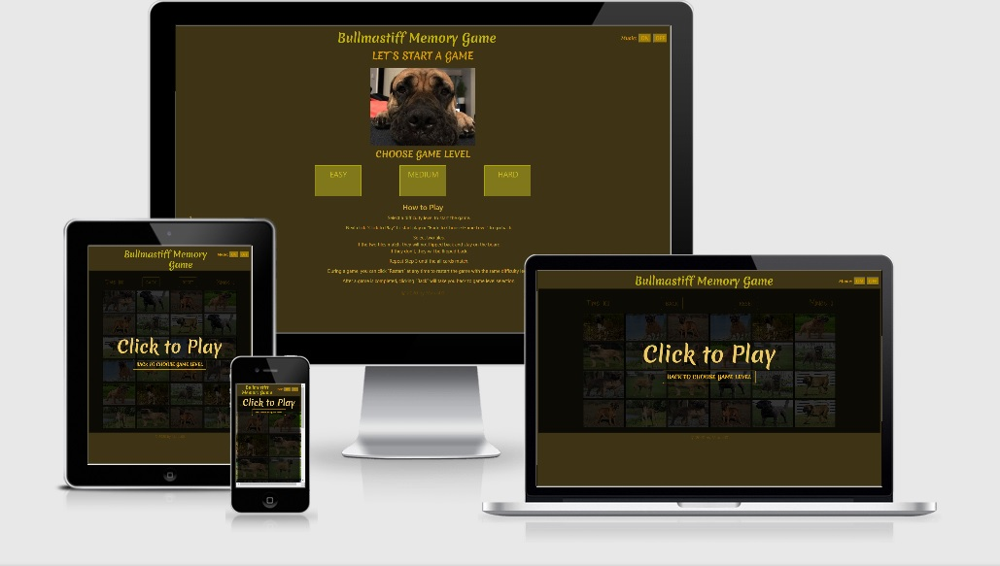

# Bullmastiff Memory Game

This page has been created for the needs of my second milestone project as a Full Stack software developer student of the Code Institute.

******************************************************************************************************
## Table of Contents
1. [**UX**](#ux)

2. [**Features**](#features)
    - [**Existing Features**](#existing-features)

3. [**Wireframes**](#wireframes)

4. [**Technologies used**](#technologies-used)
    - [**Language**](#language)
    - [**Tools Used**](#tools-used)

4. [**Testing**](#testing)

5. [**Deployment**](#deployment)

6. [**Credits**](#credits)
    - [**Media**](#media)
    - [**Acknowledgments**](#acknowledgments)

******************************************************************************************************

## UX

This game is meant to be fun, but also develop your memory skills at the same time. Mostly intended for children, but people of all ages can play it. More advanced players can start at more difficult levels, and enjoy themselves while giving their memory a little bit of a workout. 

The following user stories have been identified:

1. As a user, I want the home screen to be visually appealing, making me want to try the game.
2. As a user, I want to be able to start the game easily.
3. As a user, I want to be able to choose a difficulty level.
4. As a user, I want to be provided with instructions on how to play the game.
5. As a user, I want to be able to restart the game without going back to the home page.
6. As a user, I want to know if I lose or win the game.
7. As a user, I want to have fun.

##### Back to [Top](#table-of-contents)

## Features

### Existing Features

#### Home Page 

1. Section "CHOOSE GAME LEVEL" where you can pick a level of difficulty. There are three levels: "EASY", "MEDIUM" and "HARD". All of them will take you to a different page where you can start the game after clicking on "CLICK TO PLAY" or "BACK TO CHOOSE GAME LEVEL" to go back and pick a different level.

2. Section "How To Play" will toggle after clicking on the instructions.

#### Game Page 

After clicking "CLICK TO PLAY" the game starts. You have the option to go back to "CHOOSE GAME LEVEL"by clicking the button "BACK" or "RESET" to start from the beginning. Every page has two music buttons: "ON" and "OFF". 

##### Back to [Top](#table-of-contents)

## Wireframes
[Desktop index.html](assets/img/wireframes/DesktopIndex.png)

[Desktop index16.html](assets/img/wireframes/DesktopIndex16.png)

[Desktop index20.html](assets/img/wireframes/DesktopIndex20.png)

[Desktop index24.html](assets/img/wireframes/DesktopIndex24.png)

[Ipad index.html](assets/img/wireframes/IpadIndex.png)

[Ipad index16.html](assets/img/wireframes/IpadIndex16.png)

[Ipad index20.html](assets/img/wireframes/IpadIndex20.png)

[Ipad index24.html](assets/img/wireframes/IpadIndex24.png)

[Mobile index.html](assets/img/wireframes/MobileIndex.png)

[Mobile index16.html](assets/img/wireframes/MobileIndex16.png)

[Mobile index20.html](assets/img/wireframes/MobileIndex20.png)

[Mobile index24.html](assets/img/wireframes/MobileIndex24.png)

The wireframes were made using [Moqups](https://moqups.com/)

##### Back to [Top](#table-of-contents)

## Technologies Used

### Language

- HTML - standard language used to create this page.
- CSS - standard language that describes the style of HTML.
- Javascript - standard language for game functions.
- Bootstrap CDN - used as the core structuring layout for the application, ensuring mobile-first design and screen size fluidity.
- Github - used to host the repository.
- JQuery - used to simplify DOM manipulation. 

### Tools Used

- Google Fonts - to style the website fonts.

## Testing

The project was tested on development tools in Google Chrome and the responsiveness of mobile devices and Ipads was also tested.

- Moto G4
- Galaxy S5
- Pixel 2
- Pixel 2XL 
- Iphone 5/SE 
- Iphone 6/7/8
- Iphone 6/7/8Plus
- IphoneX
- Ipad
- Ipad Pro 
- Surface Duo 
- Galaxy Fold 

The first of the testing steps was on W3C Markup Validation and W3C CSS validation with no errors found.

The second testing step was http://ami.responsivedesign.is/, which has been used to see how the site performs on different devices and their viewports. All pages, links, icons performed as expected on all devices. I also used it to create the all-devices.jpg at the top of this Readme file.

The third step was testing by the Slack community, my mentor from the Code Institute and my friends and family.

Testing consists of finding any errors that could reveal incorrect operation of the website during its use. The website was also tested on private mobile devices like Iphone 7, Samsung A20 and Ipad 7.

All problems related to the functioning of the site have been resolved.

##### Back to [Top](#table-of-contents)

## Deployment

My website is hosted on GitHub Pages, follow the instructions:

GitHub Pages
Navigate to my Github repository - https://github.com/Maras00/MP2
Click on the settings tab at the top of the page.
Scroll down to the GitHub Pages section.
Change the source to master branch.
After selecting master branch the page will refresh.
Scroll down to the GitHub Pages section and a green box saying "your site is published at" will appear.
Click the link to go to the published website.

You can view the deployed website here - https://maras00.github.io/MP2/

Git Clone
Navigate to my Github repository - https://github.com/Maras00/MP2
Click the green drop down that says clone or download.
To clone with HTTPS copy the URL in the box. https://github.com/Maras00/MP2.git
Open up your preferred IDE (Integrated Development Environment)
Change the directory to the location you want the clone to be made.
Type git clone and then paste the copied URL from step 3.
Press Enter and your local clone will be created.

##### Back to [Top](#table-of-contents)

## Credits

## Content
- The game uses the [Fisher-Yates shuffle](https://en.wikipedia.org/wiki/Fisher%E2%80%93Yates_shuffle) to shuffle the cards.

### Media
- The images for game cards were copied from [Google Gallery](https://www.google.com/search?q=bullmastiff&sxsrf=ALeKk02wQLw2hHvjgoSOub8IAV_0Ov_zIQ:1602948059442&source=lnms&tbm=isch&sa=X&ved=2ahUKEwjClLTt9rvsAhWXaRUIHRTCANYQ_AUoAXoECAUQAw&biw=1366&bih=625) 
- The image on Home Page is from my own gallery.
- The sounds were download from [Sound1](http://soundbible.com/1003-Ta-Da.html),[Sound2](https://freesound.org/people/msarizownya/downloaded_sounds/?page=3#sound)
- Music was downloaded from [Music](http://www.orangefreesounds.com/category/music/)

### Acknowledgements

- I received inspiration and help for this project from my mentor and Slack community.
- I received inspiration for this project from [Mix-Or-Match tutorial](https://www.youtube.com/watch?v=28VfzEiJgy4) and [Memory Card Game tutorial](https://www.youtube.com/watch?v=ZniVgo8U7ek)

##### Back to [Top](#table-of-contents)